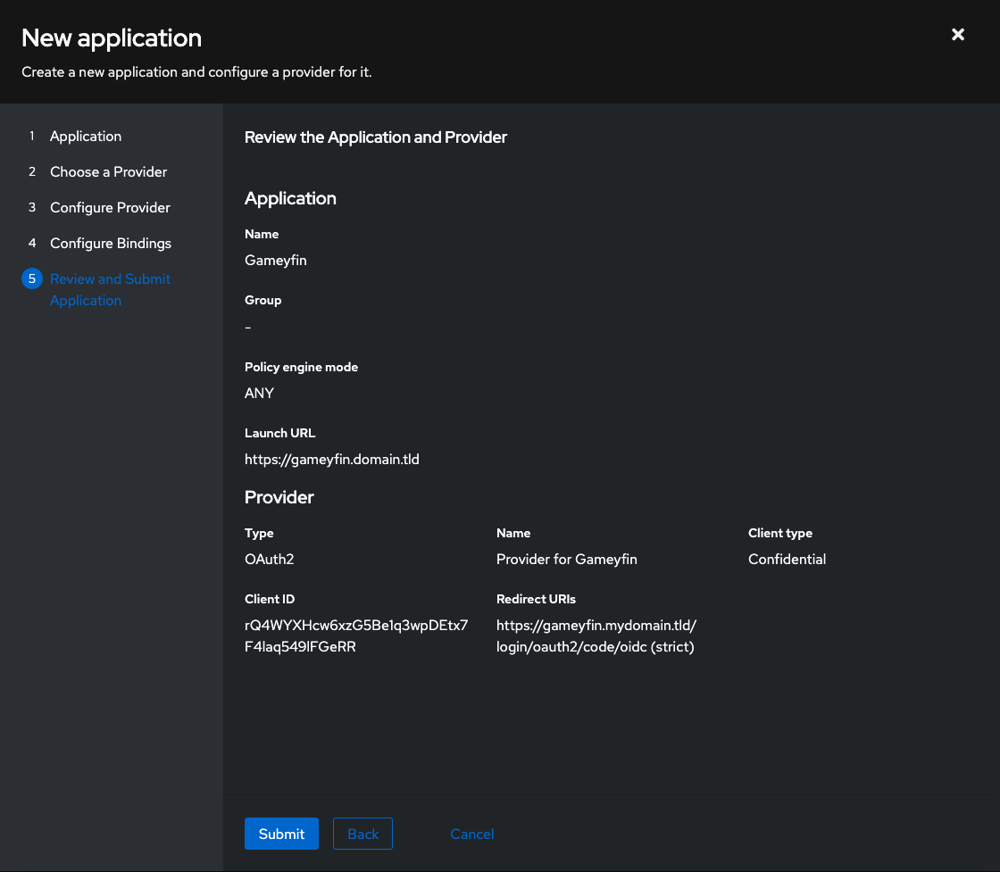

## Create an application in Authentik

Create a new application in Authentik to enable Single Sign-On (SSO) for Gameyfin.

Go to `Applications > Applications > Create with Provider` and follow these steps:

1. **Application**: Fill out to your liking.
2. **Choose a Provider**: `OAuth2/OpenID Provider`
3. **Configure Provider**:
     - Client type: `Confidential`
     - Redirect URIs: `http(s)://<your-gameyfin-domain>/login/oauth2/code/oidc` (or leave empty for automatic detection)
4. **Configure Bindings**: Bind policies to the application as needed.
5. **Review and Submit Application**: Your settings should look similar to this:
   


## Create a property mapping

Gameyfin is able to read the users roles from SSO. To do this, you need to create groups and a property mapping in Authentik.

First create two groups in Authentik (`Directory > Groups > Create`), one for superadmins and one for admins.  
Then go to `Customization > Property Mappings > Create` and create a new mapping with the following settings:

- **Scope name**: `profile`
- **Expression**: Fill out the placeholders with the groups you created above:
   ```python
   if ak_is_group_member(request.user, name="<your superadmin group name>"):
     return { "roles": ["GAMEYFIN_SUPERADMIN"] }
   if ak_is_group_member(request.user, name="<your admin group name>"):
     return { "roles": ["GAMEYFIN_ADMIN"] }
   ```
  
Users that are not in either group will automatically be assigned to "User" role.

## Configure Gameyfin

Go to Gameyfin's SSO settings page (`Administration > SSO`), enable SSO and fill out the SSO provider configuration with the values from Authentik.
You can use "Auto-populate" to fill most the values automatically, or copy them manually from the Authentik application you created earlier.

*Hint: "Auto-populate" will only work if Gameyfin and Authentik are hosted under the same domain or if you have configured a CORS policy for Authentik that allows calls from your Gameyfin domain. This is not an issue of Gameyfin but rather a security measure implemented by Authentik.*

Restart Gameyfin to apply the changes.

*Hint: If there is a problem with your SSO configuration, and you can't log in, simply append `?direct=1` to the URL to bypass SSO and login with your username and password.*

