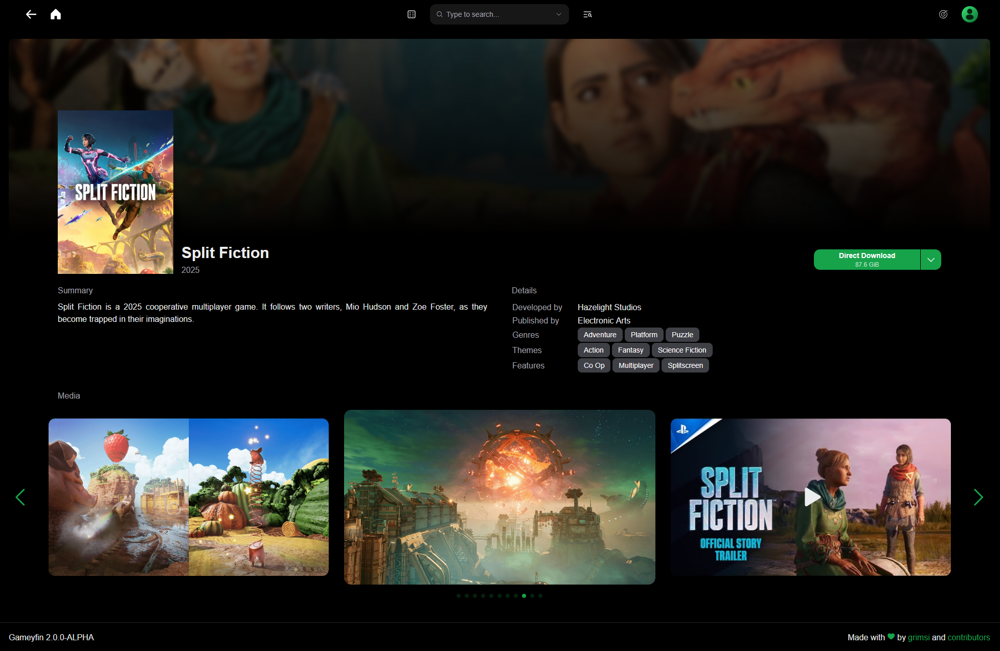

#

Your video game library manager - simple, fast, <b>FOSS</b>.

<small style="text-align: center; margin-top: 50px; display: block;">Note: All video games depicted on this site are for demonstration purposes only. Gameyfin does not endorse or support piracy. Use with appropriately licensed video games only.</small>

