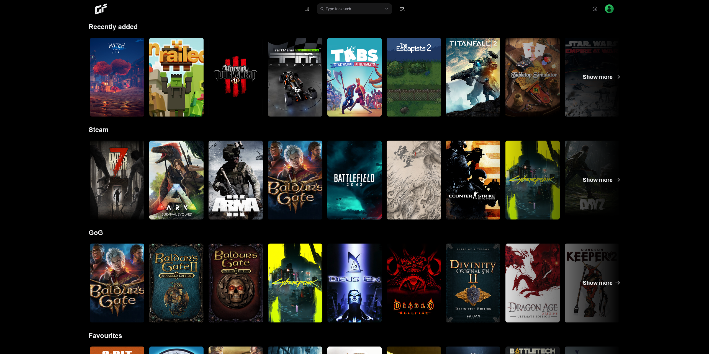
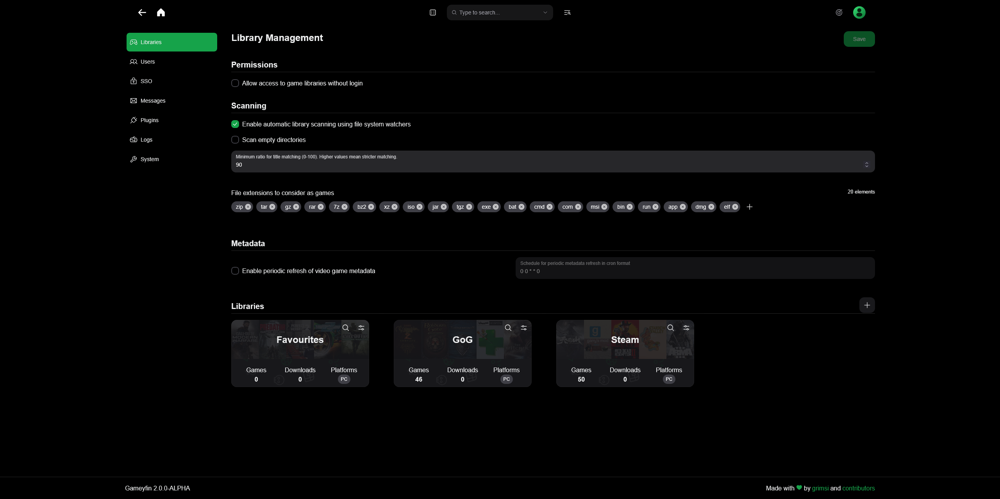
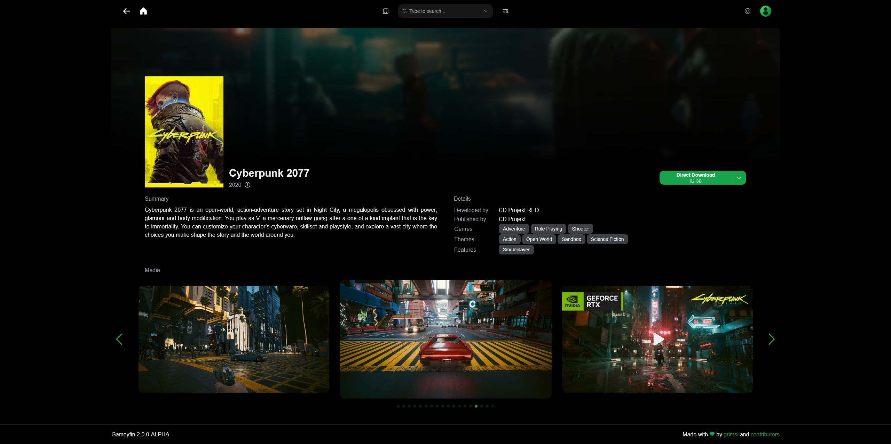
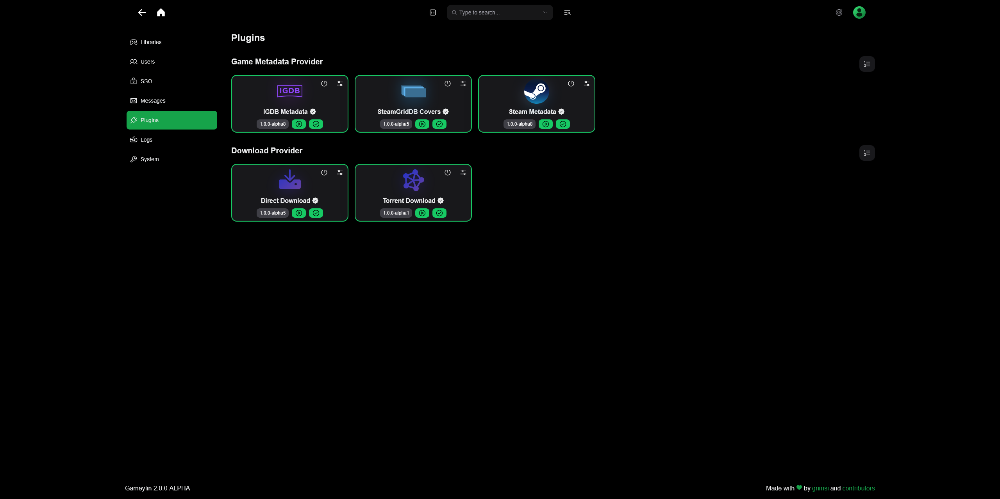

    <h1 style="margin-bottom: 0">Manage your video games.</h1>
    <h4 style="margin-top: 0; font-weight: normal; color: gray">simple / fast / <a href="https://github.com/gameyfin/gameyfin/blob/main/LICENSE.md" target="_blank">FOSS</a></h4>

{ data-title="Simple" data-description="Gameyfin doesn't care where you purchased your games. Just point it to the folder and hit scan." }
{ data-title="Flexible" data-description="Configure Gameyfin to fit your needs. Sensible defaults included." }

{ data-title="Beautiful" data-description="Give your video game library the design it deserves." }
{ data-title="Extendable" data-description="Use plugins to add new features to your personal instance." }

<small style="text-align: center; margin-top: 50px; display: block;">Note: All video games depicted on this site are for demonstration purposes only. Gameyfin does not endorse or support piracy. Use with appropriately licensed video games only.</small>

