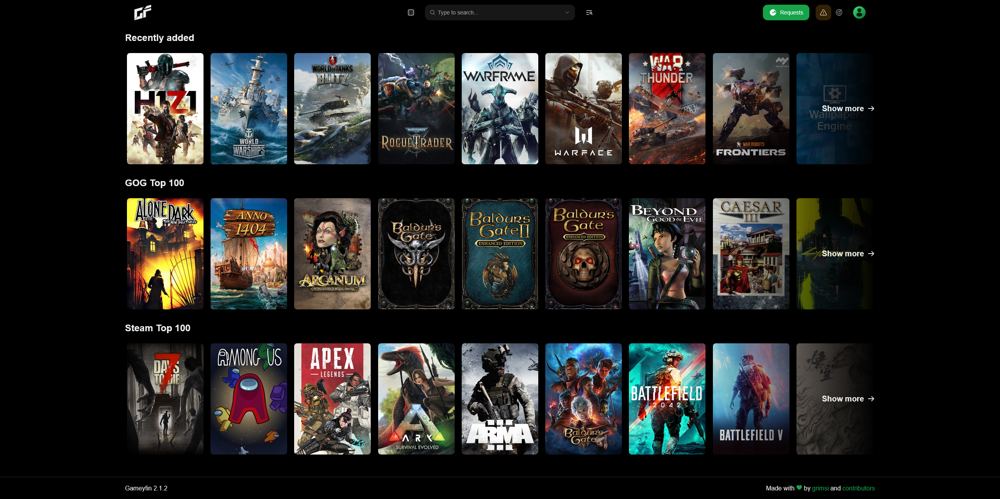
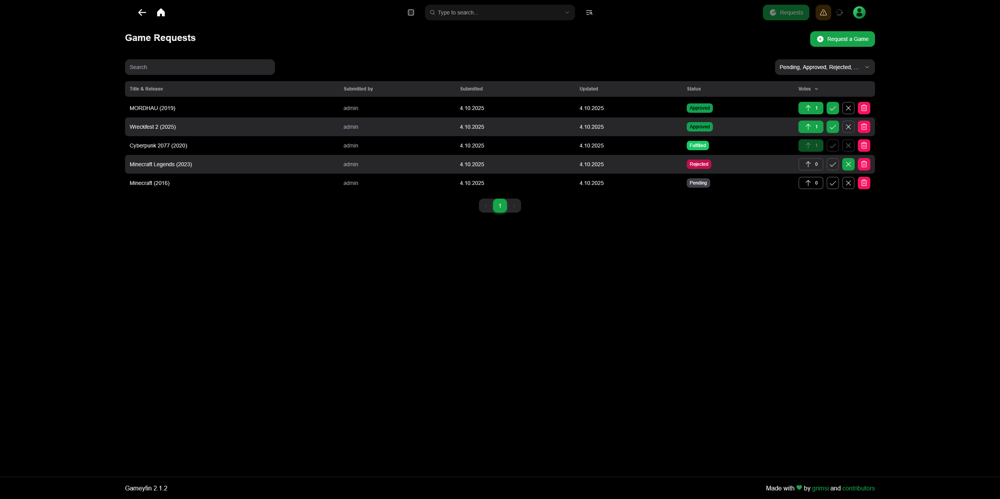
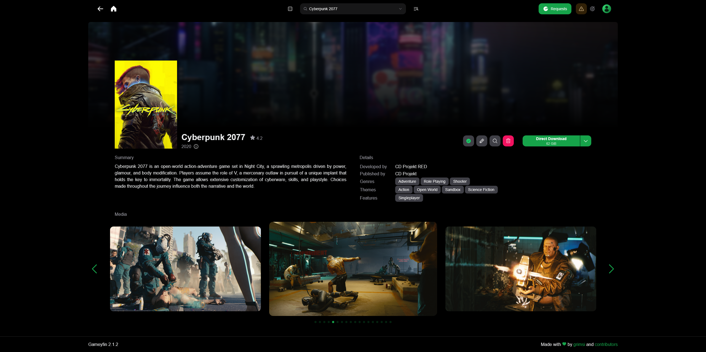
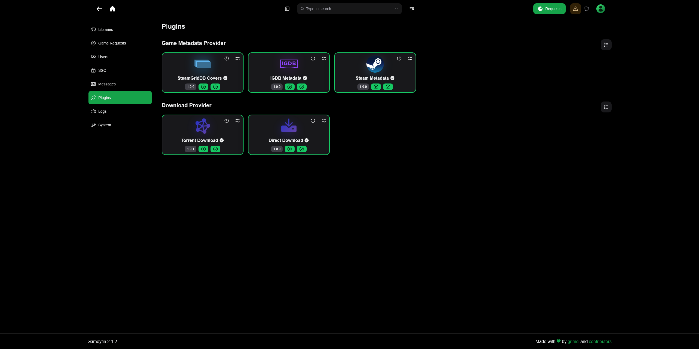

    <h1 style="margin-bottom: 0">Manage your video games.</h1>
    <h4 style="margin-top: 0; font-weight: normal; color: gray">simple / fast / <a href="https://gameyfin.org/blog/2025/12/22/why-gameyfin-is-foss/" target="_blank">FOSS</a></h4>
    

        Gameyfin will turn your disorganized collection of video games into a beautiful, easy-to-navigate library that you can access from any device with a web browser. 
        It will automatically scan your game folders, download metadata and cover images, and present everything in a user-friendly interface. 
        Download your game files directly from the web UI, share your library with friends, and enjoy your games like never before. 
    

{ data-title="Simple" data-description="Gameyfin doesn't care where you purchased your games. Just point it to the folder and hit scan." }
{ data-title="Social" data-description="New: Users can request games and vote on existing requests directly in Gameyfin." }

{ data-title="Beautiful" data-description="Give your video game library the presentation it deserves." }
{ data-title="Extendable" data-description="Use plugins to add new features to your personal instance." }

<small style="text-align: center; margin-top: 50px; display: block;">Note: All video games depicted on this site are for demonstration purposes only. Gameyfin does not endorse or support piracy. Use with appropriately licensed video games only.</small>