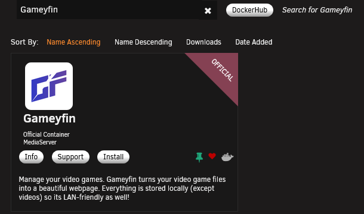

# Unraid Installation

Gameyfin has an official Unraid app available in the Community Applications plugin.

## Installation Steps

### Installation from Community Applications
1. Open the Community Applications plugin in Unraid.
2. Search for "Gameyfin" (use the offical app).

### Configure and Install the App
1. Click on "Install" to open the configuration page.
2. Configure the app settings:
   - Set the `APP_KEY` environment variable. You can generate a new app key using the command `openssl rand -base64 32` or similar.
   - (Optional) Set the `APP_URL` environment variable if you are using a reverse proxy.
   - (Optional) Set the `PUID` and `PGID` environment variables to run Gameyfin with a specific user and group ID.
   - Map the necessary volumes for the database, data, logs, and your library folder(s).
   - (Optional) Expose the necessary ports if you want to use the included torrent plugin (6969 for the tracker and 6881 for the torrent client).
   - (Optional) Adjust the paths for the `db`, `data` and `logs` mounts if you want to store them in a different location.
3. Click on "Apply" to install and start the Gameyfin container.

## First steps

Proceed to the [Getting Started](getting-started.md) guide to learn how to configure Gameyfin and add your media library.